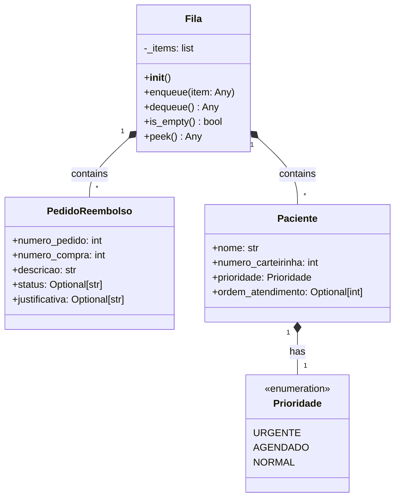

# Documento de Arquitetura de Software - TAD Fila (FIFO)

## 1. Diagrama de Classes

## 2. Descrição das Classes

### 2.1 Classe Fila
- **Propósito**: Implementa a estrutura de dados FIFO (First In, First Out)
- **Atributos**:
  - `_items`: Lista que armazena os elementos da fila
- **Métodos**:
  - `enqueue(item)`: Adiciona um elemento ao final da fila
  - `dequeue()`: Remove e retorna o primeiro elemento
  - `is_empty()`: Verifica se a fila está vazia
  - `peek()`: Retorna o primeiro elemento sem removê-lo

### 2.2 Classe PedidoReembolso
- **Propósito**: Representa um pedido de reembolso
- **Atributos**:
  - `numero_pedido`: Identificador único do pedido
  - `numero_compra`: Número da compra relacionada
  - `descricao`: Descrição do pedido
  - `status`: Status do processamento
  - `justificativa`: Justificativa da decisão

### 2.3 Classe Paciente
- **Propósito**: Representa um paciente na fila de atendimento
- **Atributos**:
  - `nome`: Nome do paciente
  - `numero_carteirinha`: Identificador do paciente
  - `prioridade`: Nível de prioridade do atendimento
  - `ordem_atendimento`: Ordem na fila de atendimento

### 2.4 Enumeração Prioridade
- **Propósito**: Define os níveis de prioridade para atendimento
- **Valores**:
  - `URGENTE`: Prioridade máxima
  - `AGENDADO`: Prioridade média
  - `NORMAL`: Prioridade padrão

## 3. Relacionamentos

### 3.1 Composição
- A classe `Fila` contém uma lista de elementos que podem ser tanto `PedidoReembolso` quanto `Paciente`
- Cada `Paciente` possui uma `Prioridade` definida

### 3.2 Dependências
- A classe `Fila` depende de tipos genéricos (Any) para flexibilidade
- As classes `PedidoReembolso` e `Paciente` dependem de tipos opcionais (Optional) para campos que podem ser nulos

## 4. Considerações de Design

### 4.1 Princípios SOLID
- **Single Responsibility**: Cada classe tem uma única responsabilidade
- **Open/Closed**: A estrutura permite extensão sem modificação
- **Liskov Substitution**: A implementação mantém o contrato da interface
- **Interface Segregation**: Interfaces específicas para cada caso de uso
- **Dependency Inversion**: Dependências são baseadas em abstrações

### 4.2 Padrões de Design
- **Template Method**: Estrutura base para operações de fila
- **Strategy**: Flexibilidade na implementação de prioridades

### 4.3 Boas Práticas
- Uso de tipos estáticos para segurança
- Documentação completa das classes e métodos
- Encapsulamento adequado dos atributos
- Tratamento de casos especiais 