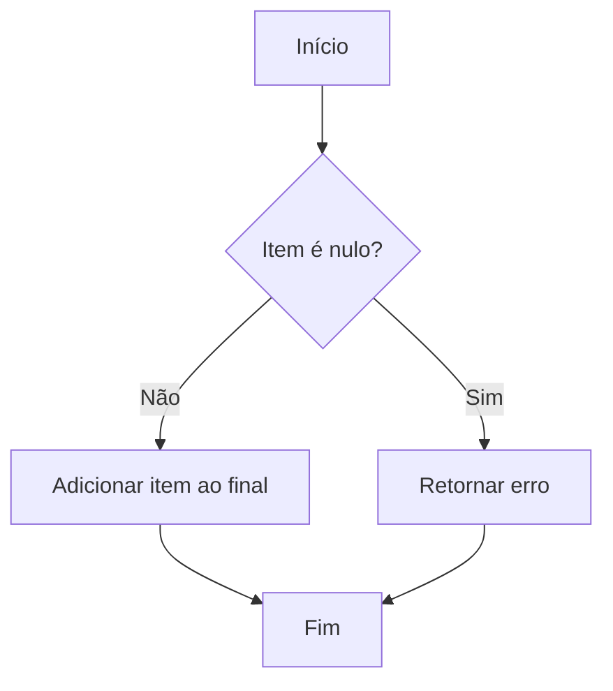
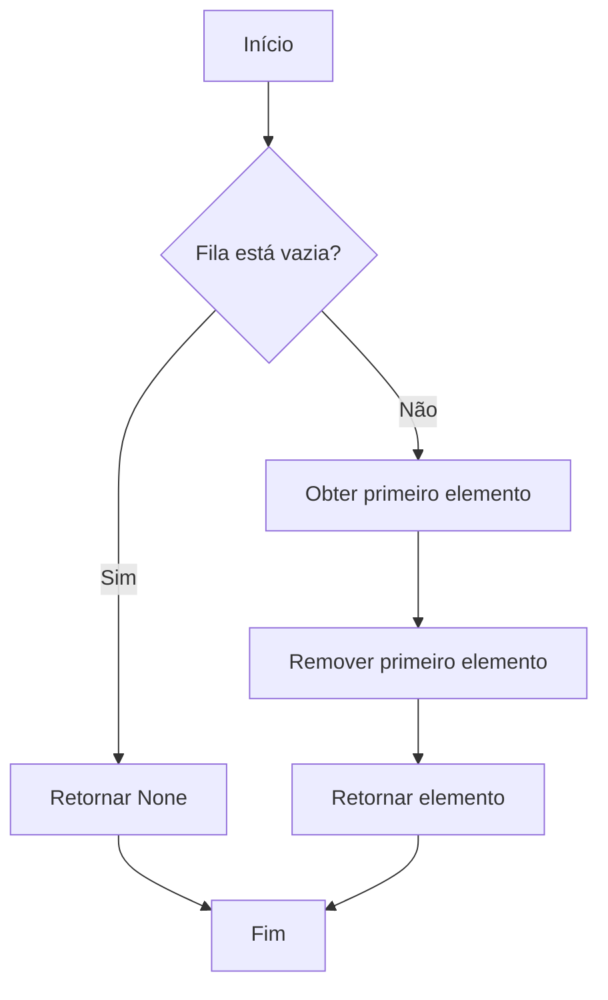
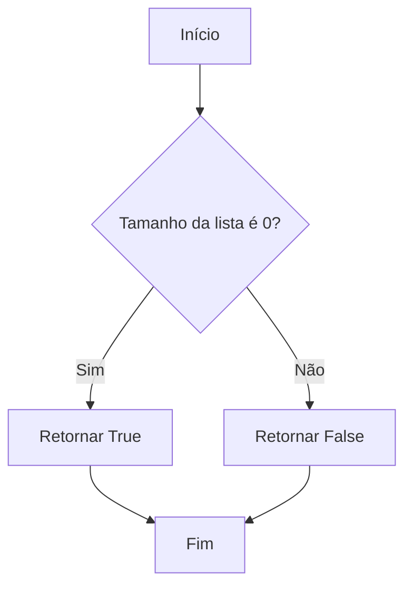
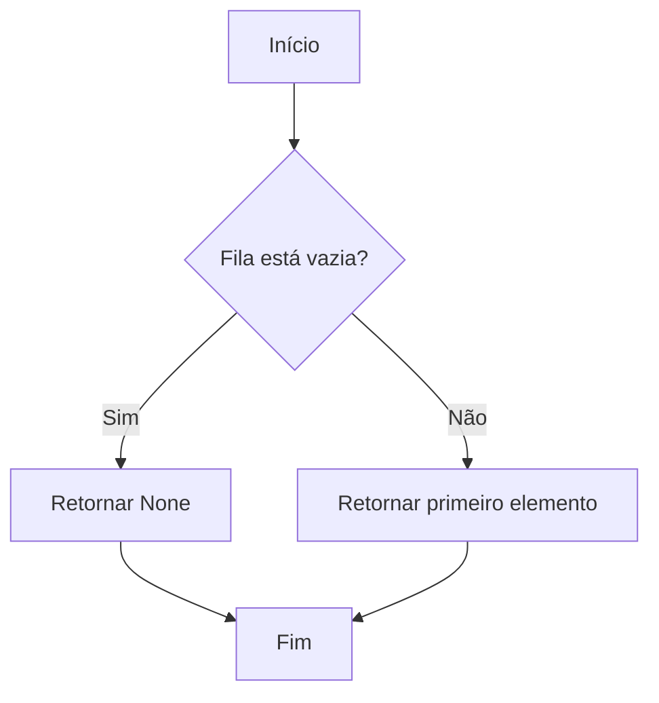

# Documento de Desenvolvimento de Algoritmos - TAD Fila (FIFO)

## 1. Algoritmos Principais

### 1.1 Enfileiramento (Enqueue)

#### Pseudocódigo
```
Algoritmo Enqueue
Entrada: item (elemento a ser enfileirado)
Saída: nenhuma

Início
    Se item é nulo então
        Retornar erro "Item não pode ser nulo"
    FimSe
    
    Adicionar item ao final da lista _items
Fim
```

#### Fluxograma


### 1.2 Desenfileiramento (Dequeue)

#### Pseudocódigo
```
Algoritmo Dequeue
Entrada: nenhuma
Saída: item (primeiro elemento da fila) ou None

Início
    Se fila está vazia então
        Retornar None
    FimSe
    
    item = primeiro elemento da lista _items
    Remover primeiro elemento da lista _items
    Retornar item
Fim
```

#### Fluxograma


### 1.3 Verificação de Fila Vazia

#### Pseudocódigo
```
Algoritmo IsEmpty
Entrada: nenhuma
Saída: booleano (True se vazia, False caso contrário)

Início
    Retornar (tamanho da lista _items é 0)
Fim
```

#### Fluxograma


### 1.4 Visualização do Primeiro Elemento

#### Pseudocódigo
```
Algoritmo Peek
Entrada: nenhuma
Saída: item (primeiro elemento) ou None

Início
    Se fila está vazia então
        Retornar None
    FimSe
    
    Retornar primeiro elemento da lista _items
Fim
```

#### Fluxograma


## 2. Análise de Complexidade

### 2.1 Complexidade Temporal
- **Enqueue**: O(1) - Adição ao final da lista
- **Dequeue**: O(1) - Remoção do primeiro elemento
- **IsEmpty**: O(1) - Verificação do tamanho da lista
- **Peek**: O(1) - Acesso ao primeiro elemento

### 2.2 Complexidade Espacial
- **Enqueue**: O(1) - Armazenamento de um elemento
- **Dequeue**: O(1) - Liberação de um elemento
- **IsEmpty**: O(1) - Sem uso de memória adicional
- **Peek**: O(1) - Sem uso de memória adicional

## 3. Considerações de Implementação

### 3.1 Estrutura de Dados
- Utilização de lista dinâmica para armazenamento
- Manutenção da ordem FIFO
- Tratamento de casos especiais

### 3.2 Otimizações
- Uso de tipos estáticos para segurança
- Validação de entrada
- Tratamento de erros

### 3.3 Limitações
- Tamanho limitado pela memória disponível
- Operações de desenfileiramento podem ser custosas em grandes listas
- Necessidade de gerenciamento de memória 